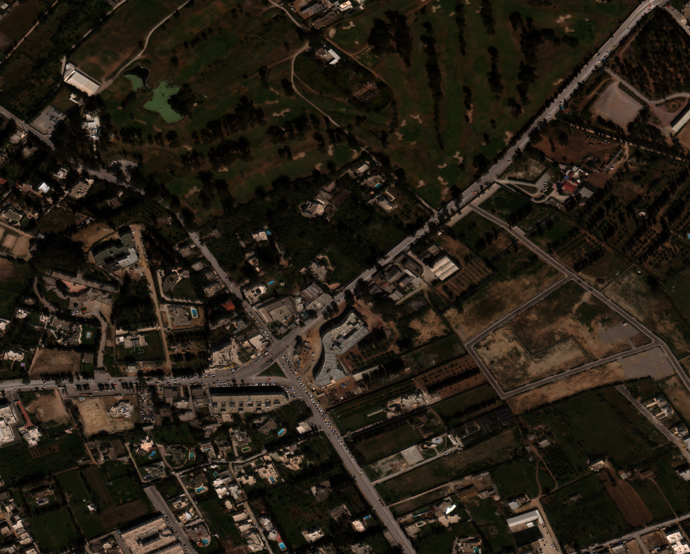
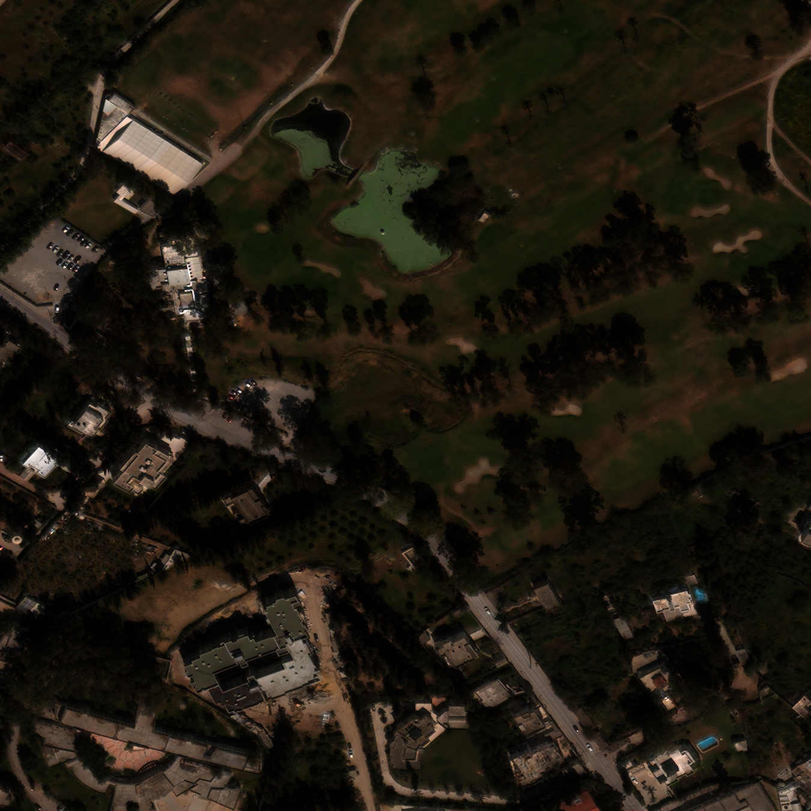
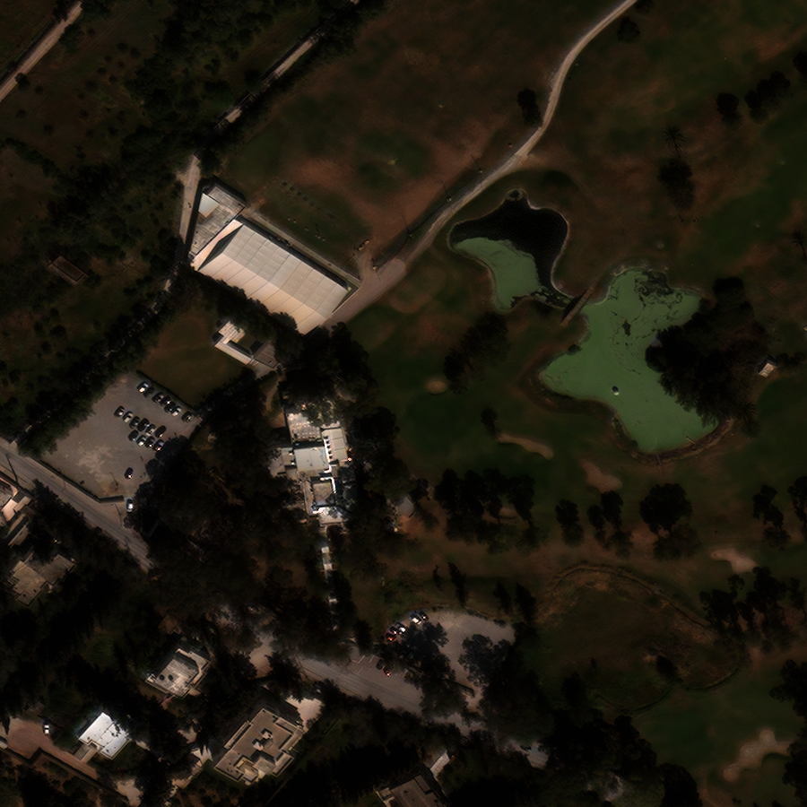

```python

import cv2
import numpy as np
import json
import base64, requests
import io, flask
from PIL import Image
```

# This is basic Autumentation API
## Limitations
### No Concurrency and Parallism is supported
## Feature
### rotate, resize, crop
## File description
### Api.pi which is basically revoking all the endpoints for passing the values
#### http://localhost:5000/rotate
#### http://localhost:5000/resize
#### http://localhost:5000/crop
everyone requires image as input and some other arguments(as data payload)


## Running Instruction
#### Run docker-compose up -d --build (This will build and make the container up and running with localhost endpoint at 5000 port open for rest request)
#### then Run this augment.pynb file to check all restful endpoints

### Rotate with no angle provided


```python
url = 'http://localhost:5000/rotate'
my_img = {'image': open('./images/satelliite/106.png', 'rb')}
payload = {'angle':"50"}
response = requests.post(url, files=my_img, data=payload)
print(response.text)
# convert server response into JSON format.
im_b64 = response.json()['image']
im_binary = base64.b64decode(im_b64)
buf = io.BytesIO(im_binary)
img = Image.open(buf)
img
```

    IOPub data rate exceeded.
    The notebook server will temporarily stop sending output
    to the client in order to avoid crashing it.
    To change this limit, set the config variable
    `--NotebookApp.iopub_data_rate_limit`.

    Current values:
    NotebookApp.iopub_data_rate_limit=1000000.0 (bytes/sec)
    NotebookApp.rate_limit_window=3.0 (secs)


### Rotate with angle provided


```python
url = 'http://127.0.0.1:5000/rotate'
my_img = {'image': open('./images/satelliite/106.png', 'rb')}
payload = {}
response = requests.post(url, files=my_img, data=payload)
print(response.text)
# convert server response into JSON format.
im_b64 = response.json()['image']
im_binary = base64.b64decode(im_b64)
buf = io.BytesIO(im_binary)
img = Image.open(buf)
img
```

    IOPub data rate exceeded.
    The notebook server will temporarily stop sending output
    to the client in order to avoid crashing it.
    To change this limit, set the config variable
    `--NotebookApp.iopub_data_rate_limit`.

    Current values:
    NotebookApp.iopub_data_rate_limit=1000000.0 (bytes/sec)
    NotebookApp.rate_limit_window=3.0 (secs)


### Resizing with  No dimention provided


```python
url = 'http://127.0.0.1:5000/resize'
my_img = {'image': open('./images/satelliite/106.png', 'rb')}

payload = {}
response = requests.post(url, files=my_img, data=payload)
# convert server response into JSON format.
im_b64 = response.json()['image']
im_binary = base64.b64decode(im_b64)
buf = io.BytesIO(im_binary)
img = Image.open(buf)
img
```





### Resizing with  dimention provided


```python
url = 'http://127.0.0.1:5000/resize'
my_img = {'image': open('./images/satelliite/106.png', 'rb')}

payload = {"lengthScale":"25", "breadthScale":"25"}
response = requests.post(url, files=my_img, data=payload)
# convert server response into JSON format.
im_b64 = response.json()['image']
im_binary = base64.b64decode(im_b64)
buf = io.BytesIO(im_binary)
img = Image.open(buf)
```


```python
img
```


### Croping with no dimention provided


```python
url = 'http://127.0.0.1:5000/crop'
my_img = {'image': open('./images/satelliite/106.png', 'rb')}

payload = {"x":"150","x1":"1500","y":"150", "y1":"1500"}
response = requests.post(url, files=my_img, data=payload)
# convert server response into JSON format.
im_b64 = response.json()['image']
im_binary = base64.b64decode(im_b64)
buf = io.BytesIO(im_binary)
img = Image.open(buf)
```


```python
img
```





### Croping with no dimention provided


```python
url = 'http://127.0.0.1:5000/crop'
my_img = {'image': open('./images/satelliite/106.png', 'rb')}

payload = {}
response = requests.post(url, files=my_img, data=payload)
# convert server response into JSON format.
im_b64 = response.json()['image']
im_binary = base64.b64decode(im_b64)
buf = io.BytesIO(im_binary)
img = Image.open(buf)
```


```python
img
```



